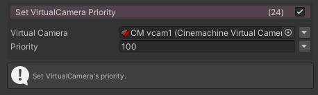
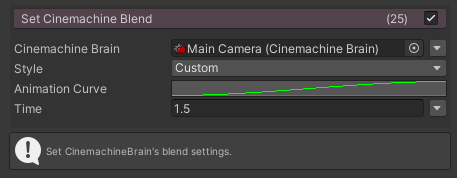

# FungusCinemachine

FungusからCinemachineを操作するコマンド

## Requirements

- Unity 2020.2.0b2
- [Fungus v3.13.7](https://github.com/snozbot/fungus)

## Git Path (Unity Package Manager)

> https://github.com/kuro3vn-gme/FungusCinemachine.git?path=Assets/FungusCinemachine

## Commands

### SetVirtualCameraPriority

選択したCinemachine VirtualCameraのPriorityを変更します。

### SetCinemachineBlend

選択したCinemachine BrainのBlendの設定を変更します。

